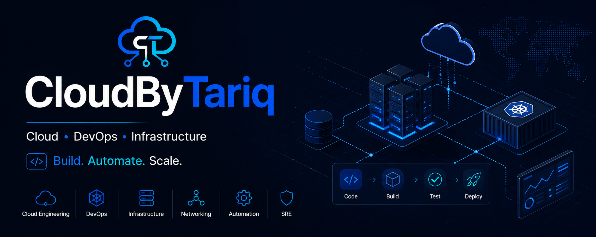

<p align="center">
  
</p>

<h1 align="center">Hi, I'm Muhammad Tariq 👋</h1>

<p align="center">
  <strong>Cloud • DevOps • Infrastructure • Networking • Automation</strong>
</p>

<p align="center">
  Building scalable systems and exploring modern cloud infrastructure.
</p>

<p align="center">
  <a href="https://github.com/cloudbytariq">
    
  </a>
  <a href="https://www.instagram.com/cloudbytariq/">
    
  </a>
</p>

---

## ☁️ About Me

I'm **Muhammad Tariq**, building my career in **Cloud Computing, DevOps, Infrastructure, Networking, and Automation**.

I'm interested in how modern systems are **designed, deployed, automated, secured, monitored, and scaled**.

My approach is simple:

> **Learn → Build → Document → Improve**

I focus on hands-on learning, practical projects, and understanding how technologies work together to build reliable and scalable systems.

---

## 🛠️ Areas of Focus

| Area | Focus |
|---|---|
| ☁️ **Cloud Engineering** | Cloud infrastructure, compute, storage, IAM & networking |
| ⚙️ **DevOps** | CI/CD, automation, deployment & engineering workflows |
| 🏗️ **Infrastructure** | Infrastructure design, provisioning & management |
| 🌐 **Networking** | TCP/IP, DNS, HTTP/HTTPS, routing & cloud networking |
| 🔄 **Automation** | Infrastructure automation & repeatable workflows |
| 📦 **Containers** | Docker & container-based deployments |
| ☸️ **Orchestration** | Kubernetes & container orchestration |
| 🏗️ **Infrastructure as Code** | Terraform & reproducible infrastructure |
| 📊 **Reliability** | Monitoring, observability & SRE concepts |

---

## 🚀 Current Learning Path

```text
Linux & Systems
       ↓
Networking Fundamentals
       ↓
Cloud Fundamentals
       ↓
AWS
       ↓
Docker & Containers
       ↓
Infrastructure as Code
       ↓
Terraform
       ↓
CI/CD
       ↓
Kubernetes
       ↓
DevOps & Platform Engineering

💻 Technologies I'm Exploring
☁️ Cloud
<p>  </p>
⚙️ DevOps & Infrastructure
<p>    </p>
🖥️ Systems & Networking
<p>   </p>
☸️ Containers & Orchestration
<p>  </p>
📌 Projects

I build practical projects to develop real-world Cloud, DevOps, and Infrastructure engineering skills.

☁️ Cloud Infrastructure

Hands-on cloud infrastructure covering networking, compute, storage, IAM, security, and monitoring.

🏗️ Infrastructure as Code

Building reproducible and version-controlled infrastructure using Terraform.

🐳 Containerized Applications

Building and deploying applications using Docker and container-based workflows.

🔄 CI/CD Automation

Creating automated build, test, and deployment workflows using CI/CD pipelines.

☸️ Kubernetes

Learning container orchestration and deploying containerized workloads using Kubernetes.

🚧 Projects are being built and documented as part of my engineering journey.

🎯 What I'm Building
Cloud
  +
Infrastructure
  +
Networking
  +
Automation
  +
DevOps
  +
Containers
  +
Infrastructure as Code
  =
Scalable & Reliable Systems
📚 Engineering Principles
Understand the fundamentals.
        ↓
Build it yourself.
        ↓
Automate repetitive work.
        ↓
Document what you learn.
        ↓
Measure and improve.
📈 My GitHub

I use GitHub as my engineering workspace to:

Build and document practical projects
Experiment with cloud technologies
Develop infrastructure and DevOps skills
Learn through hands-on implementation
Document technical concepts
Track my progress over time
🌱 Currently Learning
Linux & Systems Administration
Networking Fundamentals
Cloud Architecture
AWS
Docker
Terraform
CI/CD
Kubernetes
Infrastructure Automation
DevOps Practices
🤝 Connect With Me
## 🤝 Connect With Me

<p align="center">

<a href="https://github.com/cloudbytariq">
  
</a>

<a href="https://www.instagram.com/cloudbytariq/">
  
</a>

</p>

---

<p align="center">
  <strong>CloudByTariq ☁️</strong>
</p>

<p align="center">
  Cloud • DevOps • Infrastructure • Networking
</p>

<p align="center">
  <strong>Build. Automate. Scale.</strong>
</p>
